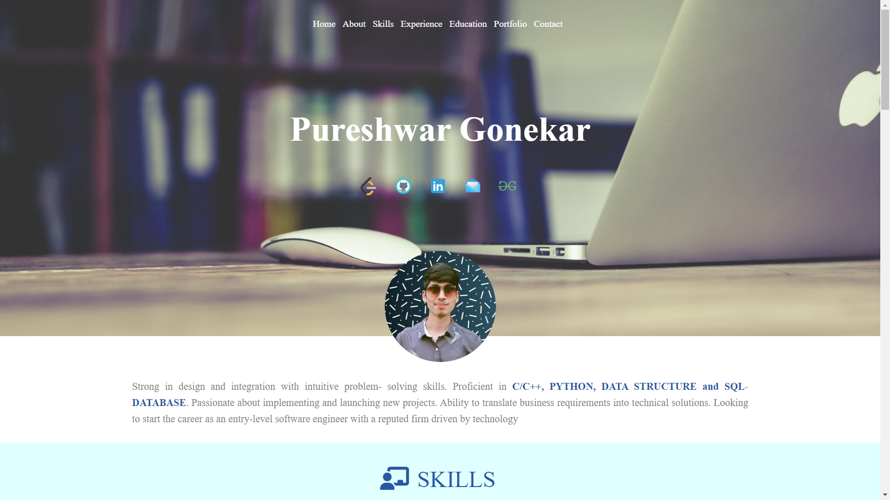
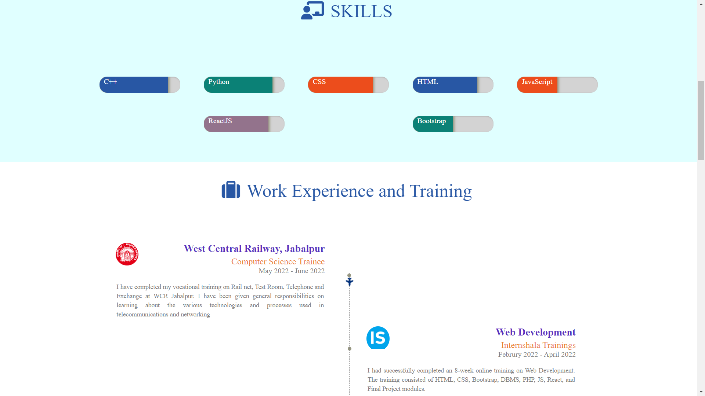
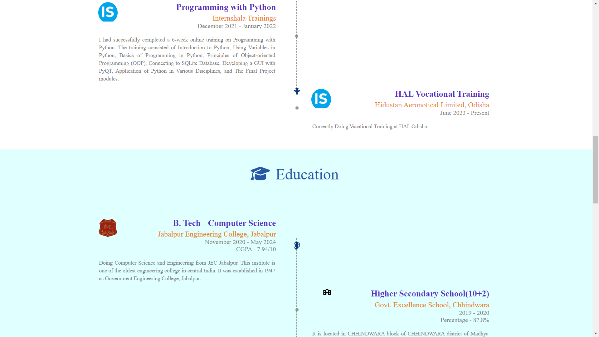
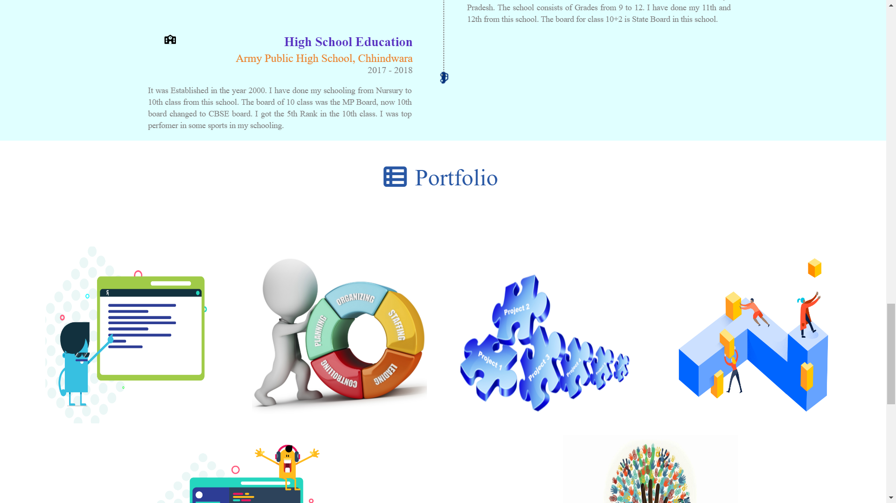
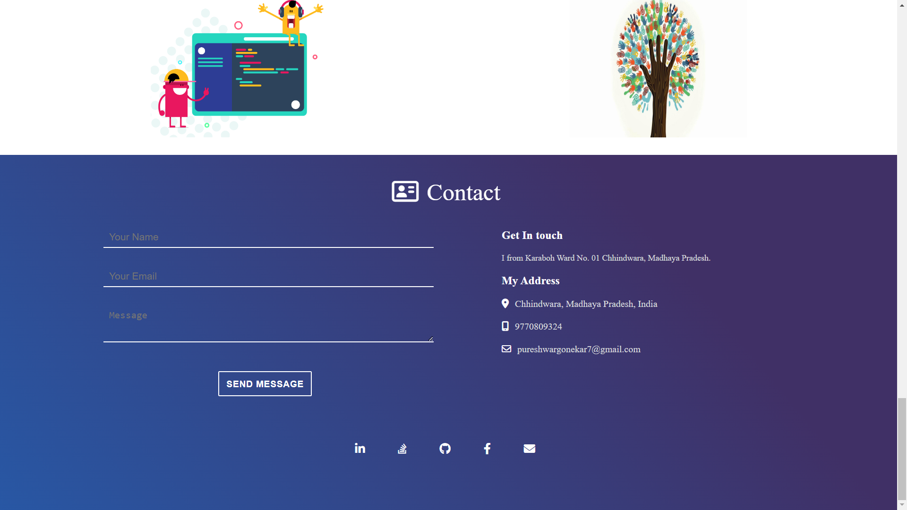

# Welcome to My Resume Portfolio!

[Live Demo](https://pureshwargonekar.github.io/My-Resume/)

In this online resume portfolio, I have leveraged the power of HTML and CSS to create a visually appealing and professional representation of my skills, experience, and achievements. This platform serves as a comprehensive showcase of my qualifications and serves as a digital hub for potential employers or clients to learn more about me.

### Key Features:

1. **Personal Information:** The resume portfolio starts with a prominent section featuring my name, professional title, and contact information. This allows visitors to quickly identify who I am and how they can reach out to me for potential opportunities.

2. **About Me:** Gain insight into my background, personality, and career objectives through a well-crafted "About Me" section. Here, I highlight my passions, professional goals, and any unique attributes that set me apart from others in my field.

3. **Work Experience:** Showcase my professional journey through a detailed work experience section. I provide information about the companies I have worked for, the positions I held, and the responsibilities and achievements I accomplished. This section gives potential employers or clients a clear understanding of my expertise and the value I can bring to their organization.

4. **Skills:** Highlight my skill set and expertise in a dedicated section. This area allows me to demonstrate my proficiency in specific tools, technologies, programming languages, or any other relevant competencies that are important in my industry.

5. **Education:** Provide details about my educational background, including degrees earned, institutions attended, and any notable academic achievements. This section helps establish my foundation and qualifications in a formal educational setting.

6. **Projects:** Showcase my notable projects, whether personal or professional, that demonstrate my abilities and creativity. I include descriptions, visuals, and any relevant links or resources to give visitors a comprehensive understanding of my work.

7. **Contact Me:** Enable visitors to get in touch with me easily by providing a contact form or linking to my email address and social media profiles. This allows for seamless communication and encourages potential opportunities to be pursued.

8. **Responsive Design:** Implement a responsive design that ensures optimal viewing experiences across various devices and screen sizes. Whether accessed on a desktop computer, tablet, or mobile phone, my resume portfolio will adapt to provide a visually appealing and user-friendly experience.

### Screenshots

 

***By creating this resume portfolio using HTML and CSS, I have crafted a powerful tool to present my qualifications, skills, and achievements to potential employers or clients. This online presence showcases my professionalism, attention to detail, and dedication to my craft.***